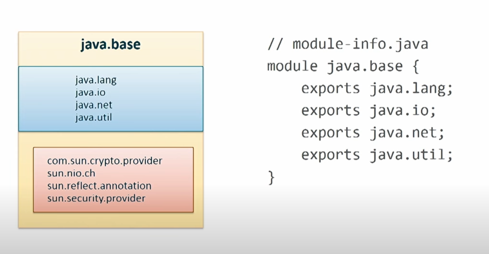
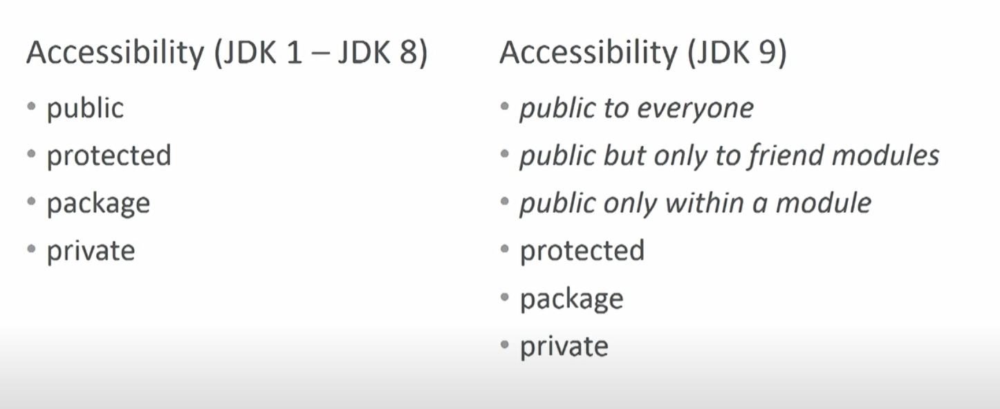

Intro to java modules

Since java 9, introduced one of key feature to the java ecosystem. JPMS (java platform modules system) helps developers maintain 
a grouping of packages into a modules, as well as common resources such as images, xml files, config files, etc.
A module is a set of packages designed for reuse. It offers strong encapsulation so that a module are explicit in what they want to expose while 
keeping its internals concealed from external use.



The blue parts are the exported packages while the red is concealed packages.
All publically exposed classes & methods are accessible only if they blue parts are exported outside of java base
All concealed packages, even if they are have the public modifier are not accessible outside of its package and are only accessile within java base 

To see all base modules in jdk use `java --list-modules` command

The goal of modules 
- scalable platform
  - Pre java 9 the Java platform was a monolith and included run time packages that might be irrelevant to your actually application. Now with java 9, you can create custom run times specific to your application. For example oracle jdk 8 includes javafx which is not required for non GUI driven applications
- optimzation
  -  optimization techniques can be more effective when it is known that a class can refer only to classes in a few other specific components rather than to any class loaded at run time.
- Strong encapsulation
   
  - The packages in a module are accessible to other modules only if the module explicitly exports them. Even then, another module cannot use those packages unless it explicitly states that it requires the other module’s capabilities. This improves platform security because fewer classes are accessible to potential attackers.
  - Before Java 9, it was possible to use many classes in the platform that were not meant for use by an app’s classes. With strong encapsulation, these internal APIs are truly encapsulated and hidden from apps using the platform. This can make migrating legacy code to modularized Java 9 problematic if your code depends on internal APIs.
- reliable dependencies
  - Developers have long suffered with the brittle, error-prone class-path mechanism for configuring program components. The class path cannot express relationships between components, so if a necessary component is missing then that will not be discovered until an attempt is made to use it. The class path also allows classes in the same package to be loaded from different components, leading to unpredictable behavior and difficult-to-diagnose errors. The proposed specification will allow a component to declare that it depends upon other components, as other components depend upon it.


# Four types of modules:

## Automatic modules:
These are unofficial modules by adding existing JAR files to the module path. 

An automatic module derives its name in 2 ways

- If the JAR defines the Automatic-Module-Name header in its `MANIFEST.MF, then that property defines the module’s name.
- Alternately, the JAR file name is used to determine the name. 

## Application Modules 
These modules are what we usually want to build when we decide to use Modules. They are named and defined in the compiled module-info.class file included in the assembled JAR.

## Unnamed modules: 
These are modules that do not have a module-info.java file and are created by the Java runtime when you launch an application. When a class or JAR is loaded onto the classpath, but not the module path, it's automatically added to the unnamed module. It's a catch-all module to maintain backward compatibility with previously-written Java code.

## Platform modules: 
These are the modules listed when we run the list-modules command above. They include the Java SE and JDK modules.

# Module Declaration

## requires 
A requires module directive specifies that this module depends on another module—this relationship is called a module dependency. Each module must explicitly state its dependencies.


## requires static
There is also a `requires static` directive to indicate that a module is required at compile time, but is optional at runtime.

<details> 
 <summary>some examples of these types of packages include:</summary> 


> Annotation processors: Annotation processors are Java programs that are used to generate code based on annotations in the source code. These processors are typically invoked by the javac compiler at compile time, but they do not need to be present on the classpath at runtime.

> Compiler plugins are Java programs that can be used to customize the behavior of the javac compiler. These plugins are typically invoked by the compiler at compile time, but they do not need to be present on the classpath at runtime.

> Code generation tools: There are a number of tools that can be used to generate Java code based on input files or other sources. These tools are typically invoked at compile time, but the generated code is usually sufficient for the program to run without the need for the tool itself at runtime.

> Debugging and profiling tools: There are a number of tools that can be used to debug or profile Java programs, such as the Java Debug Interface (JDI) and the Java Virtual Machine Tool Interface (JVMTI). These tools are usually only needed at development time and are not required at runtime.

> Test frameworks: Many Java projects use test frameworks such as JUnit or TestNG to write and run tests. These frameworks are usually only needed at development time and are not required at runtime.

</details> ````

## requires transitive
To specify a dependency on another module and to ensure that other modules reading your module also read that dependency—known as implied readability—use

Consider the following directive from the `java.desktop` module declaration:
 ```
 module java.desktop {
requires transitive java.xml;
}
```

any module that reads `java.desktop` also implicitly reads `java.xml`. 
If a method from the `java.desktop` module returns a type from `java.xml`, code that read `java.desktop` also becomes dependent on `java.xml`.
Without the `requires transitive` directive in `java.desktop`’s module declaration, such dependent modules will not compile unless they explicitly read `java.xml`.


## exports, exports...to
An exports module directive specifies one of the module’s packages whose public types (and their nested public and protected types) should be accessible to code in all other modules. An exports…to directive enables you to specify in a comma-separated list precisely which module’s or modules’ code can access the exported package—this is known as a qualified export.

## opens, opens, opens...to: 
This directive specifies a package that should be made available to other modules for reflection, but not for regular code access. However post jdk 9, it will now give you a warning if there is any code that access platform modules

> Platform modules: These are modules that are included in the Java SE platform and are used to define the core functionality of the Java runtime. Platform modules are named and are not intended to be used by applications.

Reflection is a super powerful tool that allows developer access to the internals of a package. Prior to jdk 9, it has super power

The relaxed strong encapsulation provides a launcher option –illegal-access to control the runtime behavior. We should note that the –illegal-access option only works when we use reflection to access platform modules from unnamed modules. Otherwise, this option has no effect.

The –illegal-access option has four concrete values:

permit: opens each package of platform modules to unnamed modules and shows a warning message only once
warn: is identical to “permit“, but shows a warning message per illegal reflective access operation
debug: is identical to “warn“, and also prints the corresponding stack trace
deny: disables all illegal reflective access operations
From Java 9, the –illegal-access=permit is the default mode. To use other modes, we can specify this option on the command line:

## uses: 
A uses module directive specifies a service used by this module—making the module a service consumer. A service is an object of a class that implements the interface or extends the abstract class specified in the uses directive.

## provides...with: 
A provides…with module directive specifies that a module provides a service implementation—making the module a service provider. The provides part of the directive specifies an interface or abstract class listed in a module’s uses directive and the with part of the directive specifies the name of the service provider class that implements the interface or extends the abstract class.


# Example project

To use modules you will need a compatible version of maven compiler plugin that supports JPMS
You will also need to make sure your java_home is set to java 9+

* Disclaimer there is actually a lot of extra work to get it working with spring and JPMS. The ecosystem and tooling is lacking
* `mvn spring-boot:run -pl application` actually runs the project using class path method instead of module path 

run using class path
```
mvn install
mvn spring-boot:run -pl application

```

run using modules

```

java --add-modules java.instrument --module-path=application/target/modules --module application/com.example.org.Application

```

```
curl --request POST \
  --url http://localhost:8080/book \
  --header 'Content-Type: application/json' \
  --data '{
	"author" : ["J. R. R. Tolkien"],
	"title" : "The Hobbit",
	"price": 25
	
}'

curl --request GET \
  --url http://localhost:8080/book \
  --header 'Content-Type: application/json'

```

# Further reading

[reduce java docker image size](https://blog.monosoul.dev/2022/04/25/reduce-java-docker-image-size/)
https://stackoverflow.com/questions/53633788/java-lang-illegalaccesserror-cannot-access-class-because-module-does-not-export

Debugging a java modules project with intellij is a challenging since by default uses classpath, need to investigate further into how 
to run project locally using intellij


# References

- https://developer.okta.com/blog/2020/07/27/spring-boot-using-java-modules
- https://www.oracle.com/ca-en/corporate/features/understanding-java-9-modules.html
- https://www.baeldung.com/java-illegal-reflective-access
- https://dzone.com/articles/java-9-modules-part-3-directives
- https://github.com/qutax/jpms-spring-example